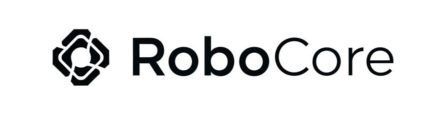

# RoboCore

Unified robotics toolkit for robot modeling, kinematics, dynamics, transforms,
planning, analysis, simulation bridges, and distance-field utilities.

[](https://pypi.org/project/synria-robocore/)
[](https://www.python.org/)
[](https://github.com/Synria-Robotics/RoboCore/actions/workflows/build-wheels.yml)
[](LICENSE)
[](CHANGELOG.md)

RoboCore is currently prepared as a `2.5.0rc4` release candidate. The core
package is designed to import cleanly without optional GPU, MuJoCo, WDF, or
robot-description assets installed.

## What It Includes

| Area | Current support |
| --- | --- |
| Modeling | URDF and MJCF parsing, robot model abstraction, chain and multi-chain helpers |
| Kinematics | FK, analytic/numeric Jacobian, DLS/pinv/transpose IK, batch APIs |
| Backends | C++/Eigen pybind11 backend (recommended), NumPy, PyTorch CPU/CUDA |
| Dynamics | RNEA, CRBA, forward dynamics by mass-matrix solve, gravity, nonlinear effects |
| Transform | SO(3), SE(3), RPY, quaternion, axis-angle conversions |
| Planning | Joint-space and Cartesian path utilities, velocity profiles |
| Analysis | Workspace sampling, reachability, singularity metrics |
| Bridge | MuJoCo simulation bridge and trajectory utilities |
| WDF | SDF/RDF utilities behind the optional `wdf` extra |
| Config | YAML configs, schemas, robot-description URI resolution |

## Installation

RoboCore requires Python `3.11+`.

```bash
git clone https://github.com/Synria-Robotics/RoboCore.git
cd RoboCore

python -m venv .venv
source .venv/bin/activate
pip install -e .
```

The C++ backend is built from source when installing the package. It requires a
C++17 compiler, `pybind11`, and Eigen3 headers. `pybind11` is installed by the
build system; Eigen3 must be installed on the system or provided via
`EIGEN3_INCLUDE_DIR`.

```bash
# Ubuntu / Debian
sudo apt update
sudo apt install build-essential libeigen3-dev

# macOS
xcode-select --install
brew install eigen

# Custom Eigen location
export EIGEN3_INCLUDE_DIR=/path/to/include/eigen3
```

Optional extras:

```bash
pip install -e ".[torch]"         # PyTorch backend
pip install -e ".[descriptions]"  # synriard robot assets used by examples/tests
pip install -e ".[benchmark]"     # pytorch_kinematics + Pinocchio comparison scripts
pip install -e ".[mujoco]"        # MuJoCo runtime bridge
pip install -e ".[sim]"           # MuJoCo + mujoco-py compatibility
pip install -e ".[wdf]"           # mesh SDF/RDF utilities
pip install -e ".[all]"           # all packaged extras
```

From PyPI:

```bash
pip install synria-robocore
pip install "synria-robocore[torch,descriptions,benchmark]"
```

`synriard` is only required for examples and tests that load published Synria
robot assets. Humanoid examples using `openrd://...` need the OpenRD package
separately when it is available.

## Quick Start

```python
import robocore as rc
from robocore.configs import resolve_description_path
from robocore.modeling import RobotModel
from robocore import dynamics
from robocore.kinematics import forward_kinematics, jacobian, inverse_kinematics

urdf = resolve_description_path("synriard://Alicia_D/v5_6/gripper_100mm/urdf")
model = RobotModel(urdf, base_link="base_link", end_link="tool0")

q = model.random_q(seed=0)

rc.set_backend("cpp")
T = forward_kinematics(model, q, return_end=True, backend="cpp")
J = jacobian(model, q, method="analytic", backend="cpp")
ik = inverse_kinematics(model, T, q, method="dls", backend="cpp")
tau_g = dynamics.gravity(model, q, backend="cpp")

print(T.shape)          # (4, 4)
print(J.shape)          # (6, model.num_chain_dof)
print(ik["success"])    # True for this reachable target
print(tau_g.shape)      # (model.num_chain_dof,)
```

## Benchmark Results

Benchmarks below are CPU results on Python `3.11.13`, Alicia-D v5.6 6-DOF arm
chains. **RoboCore C++/Eigen** is the recommended default backend. Pinocchio and
pytorch_kinematics are external comparison libraries, not RoboCore backends.
Rows prefixed with `RoboCore` are built-in backends.

`C++ advantage` is `other_time / robocore_cpp_time`; larger values mean the
RoboCore C++ backend is faster. FK/Jacobian values match NumPy within `1e-9`.

### Forward Kinematics

Chain: `base_link -> link6`. Batch call processes 100 joint configurations.

| Backend | Single call (ms) | C++ advantage | Batch call, 100 samples (ms) | C++ advantage |
| --- | ---: | ---: | ---: | ---: |
| **RoboCore C++/Eigen** | **0.003** | **1.0x** | **0.055** | **1.0x** |
| RoboCore NumPy | 0.459 | 144.2x | 0.866 | 15.6x |
| RoboCore PyTorch CPU | 2.497 | 783.8x | 3.017 | 54.5x |
| Pinocchio | 0.005 | 1.5x | 0.523 | 9.5x |
| pytorch_kinematics CPU | 0.547 | 171.5x | 1.063 | 19.2x |

### Analytic Jacobian

Chain: `base_link -> link6`. Batch call processes 100 joint configurations.

| Backend | Single call (ms) | C++ advantage | Batch call, 100 samples (ms) | C++ advantage |
| --- | ---: | ---: | ---: | ---: |
| **RoboCore C++/Eigen** | **0.003** | **1.0x** | **0.063** | **1.0x** |
| RoboCore NumPy | 0.389 | 140.6x | 29.591 | 466.5x |
| RoboCore PyTorch CPU | 2.535 | 917.2x | 6.393 | 100.8x |
| Pinocchio | 0.008 | 2.9x | 0.829 | 13.1x |
| pytorch_kinematics CPU | 0.560 | 202.6x | 0.969 | 15.3x |

### Inverse Kinematics

Chain: `base_link -> link6`. Batch call solves 50 reachable targets.

| Backend | Single solve (ms) | C++ advantage | Batch solve, 50 targets (ms) | C++ advantage | Success |
| --- | ---: | ---: | ---: | ---: | ---: |
| **RoboCore C++/Eigen DLS** | **0.016** | **1.0x** | **0.400** | **1.0x** | **50/50** |
| RoboCore NumPy DLS | 3.715 | 230.8x | 83.483 | 208.9x | 50/50 |
| RoboCore PyTorch CPU DLS | 18.952 | 1177.4x | 251.934 | 630.6x | 50/50 |
| Pinocchio CLIK | 2.566 | 159.4x | 643.515 | 1610.6x | sanity |
| pytorch_kinematics CPU | 310.299 | 19278.0x | 509.076 | 1274.1x | timing only |

### Fixed-Base Dynamics

The dynamics benchmark below is the v2.6.0 development baseline. Chain:
`base_link -> tool0`. CPU only, `samples=200`, `repeats=5`,
`inner-single=1000`, Pinocchio `4.0.0`.

| Operation | **RoboCore C++** (ms) | NumPy (ms) | C++ vs NumPy | Pinocchio (ms) | C++ vs Pinocchio | Max error |
| --- | ---: | ---: | ---: | ---: | ---: | ---: |
| RNEA inverse dynamics | **0.006** | 0.862 | 141.1x | 0.036 | 5.8x | 4.44e-16 |
| CRBA mass matrix | **0.005** | 0.881 | 174.9x | 0.036 | 7.1x | 1.39e-17 |
| Gravity | **0.007** | 0.863 | 115.6x | 0.036 | 4.8x | 4.44e-16 |
| Nonlinear effects | **0.008** | 0.862 | 111.2x | 0.036 | 4.6x | 7.77e-16 |
| Forward dynamics solve | **0.009** | 1.758 | 197.3x | 0.036 | 4.0x | 7.28e-12 |

For low-latency FK/Jacobian/IK and fixed-base dynamics, use
`rc.set_backend("cpp")` by default. The PyTorch backend remains useful for tensor
workflows and larger batched pipelines. Pinocchio and pytorch_kinematics are
included only as external references.

Full benchmark policy, commands, and raw artifacts are recorded in
[`docs/BENCHMARKS.md`](docs/BENCHMARKS.md).

Run the reproducible benchmark suite locally:

```bash
python -m robocore.benchmark kinematics \
  --robot alicia_d \
  --backends cpp,numpy,torch,pinocchio \
  --device cpu \
  --output-dir benchmark-results

python -m robocore.benchmark dynamics \
  --robot alicia_d \
  --backends cpp,numpy,pinocchio \
  --output-dir benchmark-results
```

The CLI writes JSON and Markdown reports under `benchmark-results/` with
Python/package versions, CPU/platform, robot model, chain links, batch sizes,
seeds, tolerances, and timings.

## Examples

```bash
# Kinematics
python examples/kinematics/01a_demo_fk.py
python examples/kinematics/02a_demo_jacobian.py
python examples/kinematics/03a_demo_ik.py
python examples/kinematics/04_benchmark.py

# Dynamics
python examples/dynamics/01a_demo_id.py
python examples/dynamics/02a_demo_fd.py
python examples/dynamics/03a_demo_mass_matrix.py
python examples/dynamics/05_benchmark.py
python examples/dynamics/07_validate_pinocchio.py  # requires benchmark extra

# Configs and analysis
python examples/configs/demo_with_config.py
python examples/analysis/demo_workspace.py --samples 10000
python examples/analysis/demo_singularity.py

# MuJoCo bridge, requires the mujoco extra
python examples/bridge/demo_mujoco_trajectory.py
```

## Verification

Recommended release checks:

```bash
python -c "import robocore, robocore.kinematics, robocore.transform, robocore.dynamics, robocore.configs; print(robocore.__version__)"
pytest test/unit -q
pytest test/integration -q
python -m build
python -m twine check dist/*
```

Current rc4 local validation covers Python `3.11`, `3.12`, and `3.13`; build,
twine check, core unit tests, integration smoke tests, C++ backend smoke tests,
and optional CUDA torch subset have passed. Skipped tests require optional
robot-description assets, visualization runtimes, or extra simulation packages.

Dynamics is currently treated as a fixed-base rigid-body dynamics beta surface.
RNEA/inverse dynamics, CRBA/mass matrix, forward dynamics by solving
`M(q) ddq = tau - nle(q, v)`, gravity, and nonlinear effects are supported by
the NumPy and C++/Eigen backends and can be checked against Pinocchio with the
`benchmark` extra. True O(n) ABA, floating-base dynamics, contact dynamics,
dynamics derivatives, and constrained dynamics are not part of the current
public guarantee.

## Project Layout

```text
robocore/
  modeling/      RobotModel, chain views, URDF/MJCF parsers
  kinematics/    FK, IK, Jacobian, NumPy/Torch/C++ solvers
  dynamics/      inverse/forward dynamics
  transform/     SO(3), SE(3), rotation conversions
  planning/      path and velocity-profile utilities
  analysis/      workspace and singularity analysis
  bridge/        real/simulation bridges
  configs/       YAML configs and robot-description URI helpers
  wdf/           optional SDF/RDF utilities
```

## License

RoboCore is released under the MIT License. See [LICENSE](LICENSE).

Files under `robocore/modeling/parser/mjcf_parser` preserve upstream Apache-2.0
copyright and license notices where applicable.

## Citation

```bibtex
@software{robocore2025,
  title = {RoboCore: Unified High-Throughput Robotics Library},
  author = {Synria Robotics Team},
  year = {2025},
  publisher = {Synria Robotics Co., Ltd.},
  url = {https://github.com/Synria-Robotics/RoboCore},
  version = {2.5.0rc4}
}
```

## Contact

- Website: [synriarobotics.ai](https://synriarobotics.ai)
- Email: support@synriarobotics.ai
